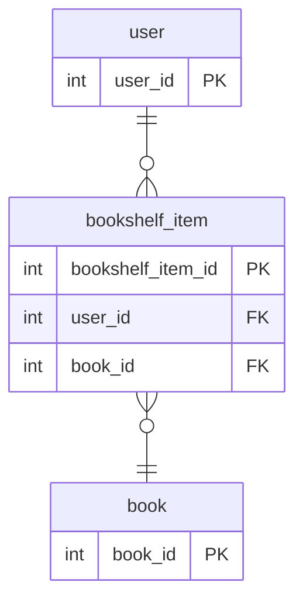

# Biblog DBのER図

```mermaid
erDiagram
    user {
        int user_id PK
    }

    book {
        int book_id PK
    }

    bookshelf_item {
        int bookshelf_item_id PK
        int user_id FK
        int book_id FK
    }

    user ||--o{ bookshelf_item : ""
    bookshelf_item }o--|| book : ""
```

※ 補助的なエンティティは省略している
